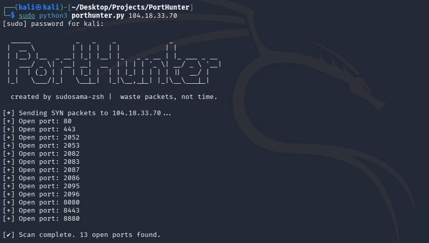

# PortHunter
PortHunter is a tool that scans all 65,535 ports on a target IP address at ultra-fast speeds, detecting open ports before a connection is established.

### Technical Details

Generates RAW TCP SYN packets with Scapy.

Sends parallel SYN to 65,535 ports.

Marks ports that return SYN-ACK as open.

Works with root permission because sending raw packets requires system level permission.

### Why do we use RAW TCP SYN?

Normal socket connections (socket.connect()) wait for the target port to respond, which is slow and unnecessary waste of time.

With Raw TCP SYN we just: send SYN (connection request),

If the port is open, the target responds with RST or SYN-ACK (that's enough for us),

We get the response and move on without ever establishing a connection.

That's why we can scan thousands of ports very quickly.

This tool does not make a full connection, it just knocks on the door and marks the port if it gets an answer.

In summary PortHunter = SYN + Speed ​​+ Stealth

```bash
pip3 install -r requirements.txt
```

```bash
sudo python3 porthunter.py 192.168.1.1
```


